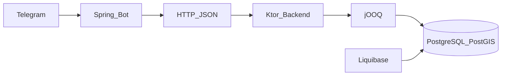

# TuTochka — technical overview

Canonical, non-marketing description of the **tutochka-backend** monorepo: **Ktor backend** + **Spring Telegram bot**, **PostgreSQL/PostGIS**, **Liquibase**, **jOOQ**.

---

## Service overview (LLM / agent context)

**Purpose:** Backend service to store and serve **public restroom** data: geographic search, city-scoped listings, and rich metadata (building, subway, fees, accessibility, schedules, text directions).

**Main scenarios:**

- Persist and query restrooms with optional links to **buildings** and **subway stations** in the same city.
- **Nearest restrooms** by user coordinates (geodesic proximity, not routing time).
- **Paginated** restroom lists (global and per city).
- **CRUD** for countries and cities (API).
- **Import pipeline** for external payloads (HTTP API + `restroom_imports` queue).
- **Telegram bot** presents search results by calling the backend over HTTP.

**Core domain entities (relational model):**

- Country, City  
- Building  
- SubwayLine, SubwayStation  
- Restroom  

**Current external interfaces:**

- **REST API** under `/api/v1` (prefix); health under `/health`.
- **OpenAPI 3** specification: [`backend/src/main/resources/openapi.yaml`](../../backend/src/main/resources/openapi.yaml) (served as static resource; interactive UI may be documented in README — verify deployment).
- **Telegram bot** (Spring Boot): HTTP client to backend `BACKEND_BASE_URL` — not a second source of truth.

**Supported (implemented in this repo):**

- REST endpoints for countries, cities, restrooms (list, by id, by city, nearest), health, import.
- PostGIS-backed **nearest** query with distance cap and KNN ordering.
- Nested **building** and **subway** objects on restroom detail responses (no separate public `/buildings` or `/subway/*` routes in current routing wiring).
- **Soft-delete** patterns for subway lines/stations and logical delete for restrooms.
- **JSONB** for amenities, phones, work times, external maps, building `externalIds`.

**Not implemented / out of scope today:**

- User-generated submissions in production flows.
- Reviews/ratings (not in schema).
- **Real photo storage** — `hasPhotos` is a boolean flag only.
- Turn-by-turn **indoor** navigation — only textual `directionGuide` / metadata.
- Fully automated, production-ready **imports from 2GIS/Yandex** as the primary operational path — import exists but end-to-end rollout is ongoing.

**Region / data status:**

- Schema supports a **global** country/city model; **actual populated data is region- and deployment-specific** (e.g. initial seeding focused on selected cities). Do not infer worldwide coverage from the schema alone.

**Backend ↔ Telegram bot:**

- Bot is a **consumer** of the REST API. All authoritative data lives in **PostgreSQL** behind the Ktor backend.

**Implementation status (high level):**

- Backend API and bot modules exist and integrate via HTTP.
- Building/subway linkage is modeled and served on restroom payloads.
- Data import and production rollout remain **in progress** (see Capability Status).

---

## Capability status

| Capability | Status | Notes |
|------------|--------|--------|
| REST API — countries / cities | Implemented | CRUD + search (see OpenAPI) |
| REST API — restrooms list / by id / by city | Implemented | Pagination on list endpoints |
| Nearest restroom search | Implemented | PostGIS `ST_DWithin` + KNN `<->`; default max distance in code |
| Building linkage on restroom | Implemented | `buildingId` + nested `building` on detail |
| Subway linkage on restroom | Implemented | `subwayStationId` + nested `subwayStation` (with `line`) |
| Telegram bot — location-based search | Implemented | Calls backend HTTP API |
| Indoor directions | Partial | `directionGuide` text only; no indoor routing engine |
| Accessibility metadata | Implemented | `accessibilityType` enum on restroom |
| Real photos | Planned | `hasPhotos` only |
| User submissions | Planned | Not exposed as product flow |
| Admin moderation UI | Planned | Not in repo as product |
| Automated imports from map providers | Partial | `POST /api/v1/import`, `restroom_imports` queue; not full automation at scale |
| OpenAPI / Swagger UI | Partial | `openapi.yaml` committed; verify Swagger UI route on running server |

---

## Non-goals / limitations

- **No indoor routing** — the service does not compute paths inside buildings; `directionGuide` is human-readable text.
- **“Global” model** means **schema and API capability**, not guaranteed worldwide data coverage.
- **Photos** are not stored as media assets; `hasPhotos` may be placeholder or future use.
- **Reviews and ratings** are not implemented (no corresponding tables in migrations).
- **Nearest search** returns **geospatial proximity** (meters) using PostGIS — **not** travel time, transit, or walking directions.
- **Map provider imports** (2GIS/Yandex/etc.) are **integration targets**, not the architectural core; the core is the REST API + PostgreSQL.
- **Telegram bot** does not own the dataset; **backend + DB** are the source of truth.

---

## Domain glossary

| Term | Meaning |
|------|---------|
| **Building** | Venue/container (mall, station building, etc.) with address and coordinates; optional `externalIds` JSONB. |
| **Restroom** | Toilet facility linked to a city and optionally a building and subway station. |
| **placeType** | Restroom semantic category (`PlaceType` enum; JSON uses snake_case names, e.g. `mall`, `public_toilet`). |
| **buildingType** | On **building** responses: same `PlaceType` enum, field name `buildingType` (not `placeType`). |
| **feeType** | Free/paid/unknown (`FeeType`). |
| **directionGuide** | Free-text instructions to find the restroom inside/near a venue. |
| **accessNote** | Access rules, codes, or restrictions. |
| **inheritBuildingSchedule** | When true, clients should treat restroom hours as following the parent building schedule. |
| **amenities** | JSONB key/value features (e.g. changing table, gender-related flags — exact keys are data-dependent). |
| **externalIds** (JSONB) | External provider IDs for **buildings** (e.g. 2GIS). Unique constraint on 2GIS key where applicable. |
| **externalMaps** (JSONB) | Structured links/metadata for external map providers on **restrooms**. |
| **coordinates** | `lat` / `lon` (WGS84) on DTOs; stored as PostGIS `geometry(Point,4326)`. |

---

## Example API responses (JSON)

Values match [`RestroomResponseDto`](../../backend/src/main/kotlin/yayauheny/by/model/restroom/RestroomResponseDto.kt) and [`NearestRestroomResponseDto`](../../backend/src/main/kotlin/yayauheny/by/model/restroom/NearestRestroomResponseDto.kt). Enums without `@SerialName` serialize as **uppercase** names (`FREE`, `WHEELCHAIR`). `PlaceType` uses **snake_case** `@SerialName` values.

### `GET /api/v1/restrooms/{id}`

```json
{
  "id": "a1b2c3d4-e5f6-4a5b-8c9d-0e1f2a3b4c5d",
  "cityId": "00000000-0000-0000-0000-0000000000c1",
  "cityName": "Minsk",
  "buildingId": "b2c3d4e5-f6a7-4b5c-9d0e-1f2a3b4c5d6e",
  "subwayStationId": "c3d4e5f6-a7b8-4c5d-0e1f-2a3b4c5d6e7f",
  "name": "Restroom in Galleria Minsk",
  "address": "Nezavisimosti Ave, 3",
  "phones": null,
  "workTime": null,
  "feeType": "FREE",
  "genderType": "UNISEX",
  "accessibilityType": "WHEELCHAIR",
  "placeType": "mall",
  "coordinates": {
    "lat": 53.905,
    "lon": 27.549
  },
  "dataSource": "IMPORT",
  "status": "ACTIVE",
  "amenities": {
    "changingTable": true,
    "female": true,
    "male": true
  },
  "externalMaps": null,
  "accessNote": "Available during mall working hours",
  "directionGuide": "3rd floor, near food court",
  "inheritBuildingSchedule": true,
  "hasPhotos": false,
  "locationType": "INSIDE_BUILDING",
  "originProvider": "TWO_GIS",
  "originId": "123456789",
  "isHidden": false,
  "createdAt": "2025-01-15T10:00:00Z",
  "updatedAt": "2025-01-15T10:00:00Z",
  "distanceMeters": null,
  "building": {
    "id": "b2c3d4e5-f6a7-4b5c-9d0e-1f2a3b4c5d6e",
    "cityId": "00000000-0000-0000-0000-0000000000c1",
    "name": "Galleria Minsk",
    "address": "Nezavisimosti Ave, 3",
    "buildingType": "mall",
    "workTime": null,
    "coordinates": {
      "lat": 53.9051,
      "lon": 27.5491
    },
    "externalIds": {
      "2gis": "70000001012345678"
    },
    "isDeleted": false,
    "createdAt": "2025-01-01T00:00:00Z",
    "updatedAt": "2025-01-01T00:00:00Z"
  },
  "subwayStation": {
    "id": "c3d4e5f6-a7b8-4c5d-0e1f-2a3b4c5d6e7f",
    "subwayLineId": "d4e5f6a7-b8c9-4d5e-1f2a-3b4c5d6e7f8a",
    "nameRu": "Немига",
    "nameEn": "Nemiga",
    "isTransfer": false,
    "coordinates": {
      "lat": 53.904,
      "lon": 27.55
    },
    "isDeleted": false,
    "createdAt": "2025-01-01T00:00:00Z",
    "line": {
      "id": "d4e5f6a7-b8c9-4d5e-1f2a-3b4c5d6e7f8a",
      "cityId": "00000000-0000-0000-0000-0000000000c1",
      "nameRu": "Московская линия",
      "nameEn": "Moscow Line",
      "shortCode": "M1",
      "hexColor": "#005BBB",
      "isDeleted": false,
      "createdAt": "2025-01-01T00:00:00Z"
    }
  }
}
```

### `GET /api/v1/restrooms/nearest?lat=53.9&lon=27.55&limit=2`

Response is a **JSON array** of slim items:

```json
[
  {
    "id": "a1b2c3d4-e5f6-4a5b-8c9d-0e1f2a3b4c5d",
    "displayName": "Restroom in Galleria Minsk",
    "distanceMeters": 212.5,
    "feeType": "FREE",
    "queryCoordinates": {
      "lat": 53.9,
      "lon": 27.55
    },
    "restroomCoordinates": {
      "lat": 53.905,
      "lon": 27.549
    }
  }
]
```

`displayName` may be an empty string if the DB name is blank; clients should apply a fallback label.

---

## How the system is organized



| Layer | Role |
|-------|------|
| **Ktor backend** | REST API, validation, serialization (kotlinx.serialization), DI (Koin). |
| **PostgreSQL + PostGIS** | Single source of truth; spatial indexes for coordinates. |
| **Liquibase** | Schema migrations under `backend/src/main/resources/db/changelog/`. |
| **jOOQ** | Type-safe SQL; generated tables in `backend/src/generated/kotlin`. |
| **Spring Boot bot** | Telegram updates → services → `WebBackendClient` → backend REST. |
| **OpenAPI** | [`openapi.yaml`](../../backend/src/main/resources/openapi.yaml) describes API contract; may lag behind code — prefer routing + DTOs as source of truth when in doubt. |

---

## Operational assumptions

- **Schedules:** `workTime` is JSONB; interpretation (timezone, locale) is a **client/bot presentation** concern unless explicitly stored. `inheritBuildingSchedule` signals that restroom hours should be derived from the building when applicable.
- **Soft-delete:** Subway lines and stations carry `isDeleted`; restrooms use `is_deleted` + filters in queries.
- **JSONB** for forward-compatible attributes (amenities, external references) without schema churn.
- **Nearest search** requires valid `lat`/`lon`; results are **ACTIVE**, not deleted, not hidden, within `distanceMeters` (defaults: **5000** m max radius, **5** results — see `ApiConstants.DEFAULT_MAX_DISTANCE_METERS`, `DEFAULT_MAX_NEAREST_RESTROOMS_SIZE`; overridable via query params).
- **Proximity** is **geodesic** distance (geography-based in repository), not road network or travel time.

---

## Database indexes and JSONB (reference)

Derived from Liquibase migrations (initial + follow-ups). Purpose: **spatial** filters, **GIN** JSONB, **partial** indexes for hot filters.

### Restrooms

| Index | Mechanism |
|-------|-----------|
| `idx_restrooms_coordinates` | GiST on `coordinates` |
| `idx_restrooms_filters` | B-tree on `(fee_type, gender_type, accessibility_type, place_type)` WHERE `is_deleted = false` |
| `idx_restrooms_building_id` | `building_id` |
| `idx_restrooms_external_maps` | GIN on `external_maps` |
| `uq_restrooms_origin` | UNIQUE `(origin_provider, origin_id)` |
| `idx_restrooms_location_type` | partial on `location_type` |
| `idx_restrooms_hidden` | partial on `is_hidden` |
| `idx_restrooms_status` | partial on `status` |
| `idx_restrooms_city_id` | partial on `city_id` |

### Buildings

| Index | Mechanism |
|-------|-----------|
| `idx_buildings_coordinates` | GiST |
| `idx_buildings_external_ids` | GIN on `external_ids` |
| `uq_buildings_2gis` | UNIQUE on `(external_ids->>'2gis')` |

### Cities / subway

| Index | Mechanism |
|-------|-----------|
| `idx_cities_bounds`, `idx_cities_coordinates` | GiST |
| `idx_cities_country_id` | partial |
| `idx_subway_stations_coordinates` | GiST |

### Import queue (`restroom_imports`)

Includes `uq_restroom_imports_provider_entity_external`, `idx_restroom_imports_queue`, `idx_restroom_imports_provider_city_status`, and earlier indexes on provider/status/ids/created_at.

---

## Geospatial behavior (API contract)

Implementation uses helpers in [`GeoDsl.kt`](../../backend/src/main/kotlin/yayauheny/by/util/GeoDsl.kt):

- **`withinDistanceOf`** — `ST_DWithin` in geography-friendly form (meters) with GiST-friendly index use.
- **`knnOrderTo`** — KNN operator `<->` for order-by-nearest.
- **`distanceGeographyTo`** — distance in meters (geography) for the selected point.

Nearest endpoint combines a **distance cap**, **KNN ordering**, and filters for active/public restrooms. This is **not** a route planner.

---

## Stack versions (reference)

See [`libs.versions.toml`](../../libs.versions.toml) and Gradle modules for authoritative versions. Indicative: Kotlin (JVM 21), Ktor 3.x, jOOQ 3.20.x, PostgreSQL driver 42.x, Liquibase 2.x, PostGIS in database.

---

## Related documentation

- [Docs index](../DOCS_INDEX.md)
- [Import architecture](../../backend/docs/IMPORT_ARCHITECTURE.md)
- [Import audit](../../backend/docs/IMPORT_AUDIT.md)
